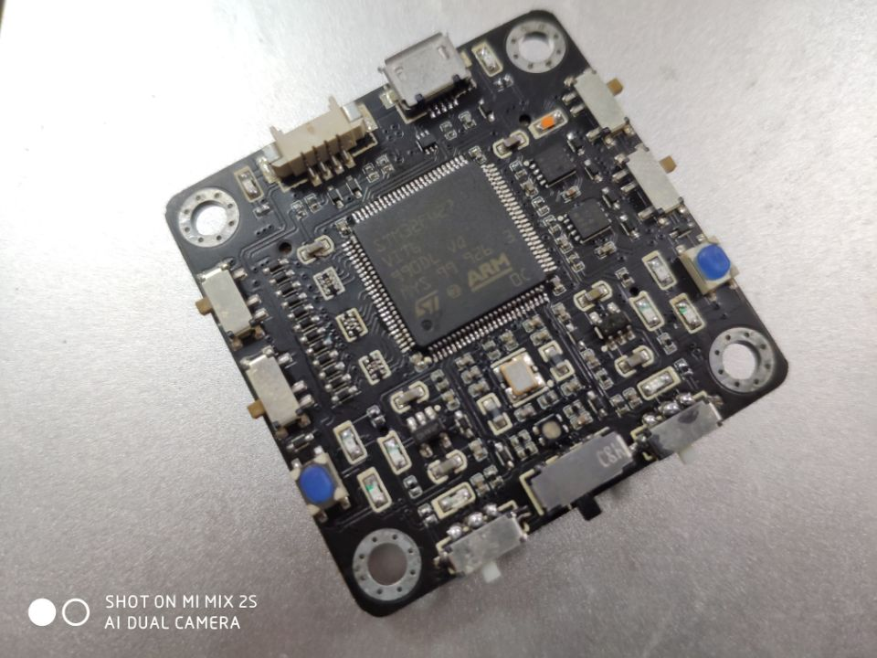

## 简介

本文档为HERO2020赛季使用核心板的 BSP (板级支持包) 说明。

主要内容如下：
- 核心板引出资源介绍
- BSP 快速上手
- 在合作时必须遵守的规则，需要注意的提交规范

## 核心板介绍

核心板外观如下图所示：

该核心板常用 **板载资源** 如下：

- MCU：STM32F427VI，主频 168MHz。
- 常用核心板外设
  - LED：2个（PC4,PE2）
  - 按键：1个（PC5）
  - RGB彩灯：1个（red:PE6,green:PE2,blue:PA2）
  - 拨码开关：2个（PE3,PA6）
  - 无源蜂鸣器：1个（PB10）
  - OTG接口：1个（D-:PA11,D+:PA12）
  - 其他功能清根据底板引出情况选择
- 常用接口：根据底板不同引出接口会不同
- 调试接口，标准 SWD

其他核板相关资料请参考子翔的[核心板使用说明](https://gitee.com/HIT-718LC/herorm_electric_control/tree/master/RM%E6%A0%B8%E5%BF%83%E6%9D%BF%E7%AC%AC%E5%9B%9B%E4%BB%A3%E5%8F%8A%E9%85%8D%E5%A5%97%E8%B5%84%E6%96%99)

## 外设支持

本 BSP 目前对外设的支持情况如下：

| **板载外设**      | **支持情况** | **备注**                              |
| :-----------------| :----------: | :-------------------------------------|
| CAN               |     支持     |  CAN1/2                               |
| **片上外设**      | **支持情况** | **备注**                              |
| GPIO              |     支持     | 所有引出的具有GPIO功能的引脚均可         |
| UART              |     支持     | UART1/3/6/7/8                         |
| SPI               |     支持     | SPI3/4                                |
| I2C               |     支持     | I2C1                                  |
| ADC               |     支持     | ADC1 CH3/10/11/12/13                  |
| DAC               |   暂不支持   | 即将支持（同下）                        |
| SDIO              |   暂不支持   | 即将支持（别想了）                      |
| PWM               |     支持     | PWM1(CH1/2) 2(CH3) 4(CH1/2/3/4) 5(CH3) 8(CH3/4) 9(CH1/2)  |
| WDG               |     支持     | IWDG                                  |
| **扩展模块**      | **支持情况** | **备注**                              |
| 暂无              |              |                                       |

## 特点介绍

该BSP在外设设备上又进行了一次封装，类似配置设备，同样可以通过`menuconfig`来配置机构，可用机构均放置在`public`文件夹下，如果有新加入机构的需求，需要更改对应的构建工程脚本，为防止遭到不必要的修(mo)改(gai)，不在此说明修改方式。

## 使用说明

所有以`RM-`开头的文件夹均为放置Keil工程的文件夹，其中每个兵种文件夹下又包含了若干个工程文件夹，如`RM-Infantry-project\chassis`目录下的`project.uvoptx`，就是一个可以打开的工程，如果需要对某个工程进行配置，在有工程的文件夹内右键，进入env工具即可进行配置。每个工程的配置均是不同的，但是同样，当你需要创建一个新的工程时，也需要将某个工程文件夹内的所有文件（可以不包含配置文件和编译文件）粘贴到类似`RM-Infantry-project\chassis`目录的文件夹内，即可开始你的工作。 
更详细的使用说明和工程制作过程请[点击这里](https://hitwhlc.yuque.com/hero-rm/platform_3)

## 使用时需要遵守的规则

1. 所有中文需要使用`GB2312`编码格式
2. 禁止更改非自己负责的`public`文件夹下的文件，如有必要请在和其创建人联系后修改
3. **应确保每次提交至云端的工程均是可运行的！**
4. 尽可能一次提交只包含有关一个bug或问题的更改

## 更新摘要

> 2020.2.16
>> 1. 修复了UART7/8无法使用 DMA 接收的 bug,
>> 2. 添加了 adc1 和 IWDG 设备
>> 3. 取消core_board文件，更改为buzzer和rgblight文件
>> 4. 现在使用scons可以自动添加所需的驱动文件
>> 5. 加入了软件监视器功能

> 2020.8.7
>> 1. 将单工程模板转化为多工程模板
>> 2. 更新了多工程所需的自动构建脚本
>> 3. 现在可以在`menuconfig`菜单中对可能需要的公共文件进行配置
>> 4. 现在使用`gitee`对工程文件进行同步，[仓库地址](https://gitee.com/hero_robomaster/RM2020EC)
>> 5. 现在工程目录下的所有存在中文的文件均使用`GB2312`编码格式

## 联系人信息

维护人:

-  Mqy, 邮箱：<180220214@stu.hit.edu.cn>

核心板制作人
-  XZX，邮箱：<1287285587@qq.com>
